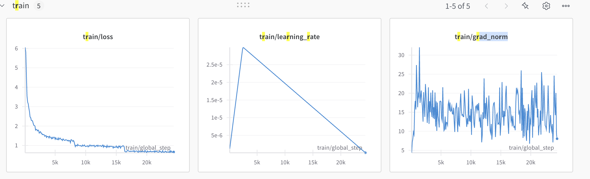
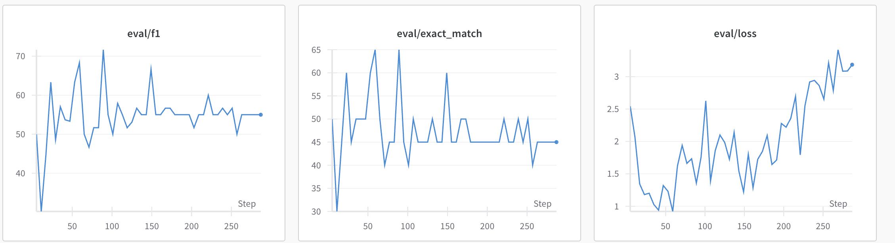
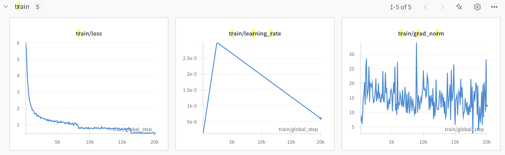
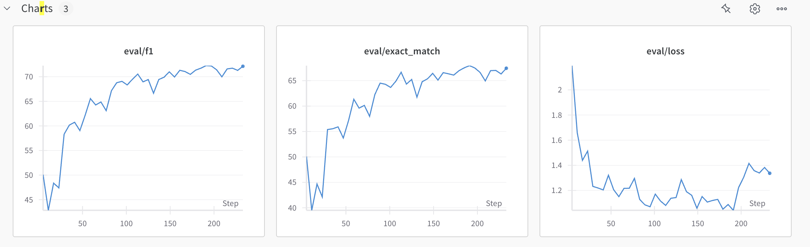
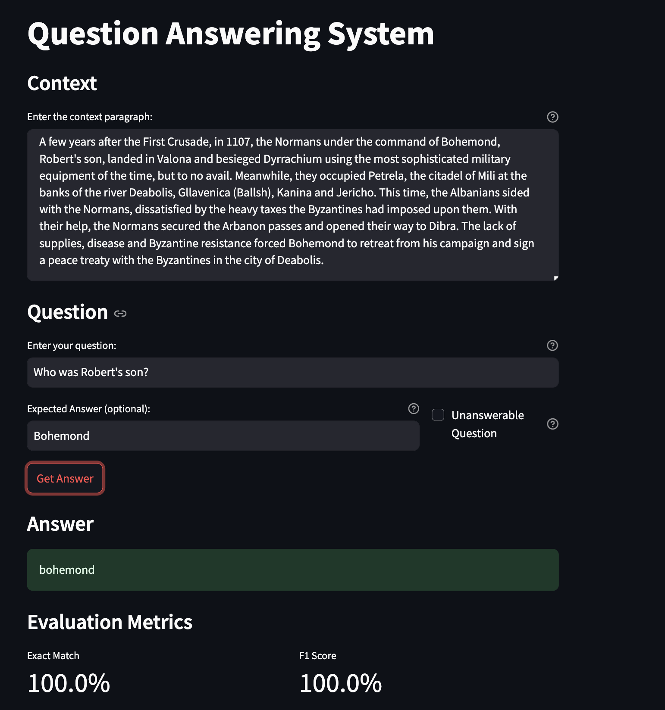

# Question Answering on SQuAD 2.0

## Research

### Task Understanding
SQuAD 2.0 combines extractive question answering with unanswerable questions, requiring models to either:
1. Extract a text span from the context as an answer
2. Determine the question is unanswerable based on context
This introduces the challenge of verifying answerability while maintaining reading comprehension capabilities. The evaluation uses Exact Match (EM) and F1-score metrics.

### Data Understanding
The dataset contains:
- 100,000+ QA pairs from Wikipedia articles
- 50% unanswerable questions (not present in v1.1)
- Multiple valid answer spans for some questions
Challenges include handling answer ambiguity, long contexts (up to 800 tokens), and distinguishing similar but incorrect answers.

**Relevant Papers:** 
* [SQUAD 1.1](https://arxiv.org/pdf/1806.03822.pdf)
* [SQUAD 2.0](https://arxiv.org/pdf/1606.05250.pdf)


### SOTA Approaches
[Question Answering on SQuAD2.0 Benchmark](https://paperswithcode.com/sota/question-answering-on-squad20)

Current state-of-the-art methods leverage:
- Pretrained transformer architectures (BERT, RoBERTa, ELECTRA)
- Two-stage approaches (answer verification + extraction)
- Attention mechanism modifications for context-question alignment

**Relevant Papers:** 
* [ Retrospective Reader for Machine Reading Comprehension](https://arxiv.org/pdf/2001.09694v4)
* [ALBERT: A LITE BERT FOR SELF-SUPERVISEDLEARNING OF LANGUAGE REPRESENTATIONS](https://arxiv.org/pdf/1909.11942)
* [ELECTRA: PRE-TRAINING TEXT ENCODERSAS DISCRIMINATORS RATHER THAN GENERATORS](https://arxiv.org/pdf/2003.10555)
* [SG-Net: Syntax Guided Transformer for Language Representation](https://arxiv.org/pdf/2012.13915)
* [XLNet: Generalized Autoregressive Pretraining for Language Understanding](https://arxiv.org/pdf/1906.08237)

### My approach
For a baseline, I trained a [DistilBERT](https://huggingface.co/telord/distillbert-base-uncased-squad-v2) model with a simple span extraction approach for training/evaluation. 

Then I adjusted pipeline to set up the evaluation considering best match across multiple valid answers and trained [Bert-based](https://huggingface.co/telord/bert-base-uncased-squad-v2) model.

## Development

### Data Preparation
- Implemented answer span selection using dataclass
- Truncation strategy: `'only_second'` to preserve question integrity
- Handled multiple answer spans by selecting first occurrence

* [Hugging Face QA pipeline preprocessing](https://huggingface.co/docs/transformers/tasks/question_answering)

### Modeling
- Training pipeline built with Hugging Face `Trainer`
- Logging integration with [Weights & Biases (W&B)](https://wandb.ai/site)
- Hyperparameters: 
```
max_length=384
learning_rate=3e-5
train_batch_size=16
eval_batch_size=16
num_train_epochs=3
weight_decay=0.01
warmup_ratio=0.1
logging_steps=100
evaluation_strategy="steps"
eval_steps=500
save_steps=500
```
**DistillBert:** 
I set up val for 20 samples to speed up training for a baseline model just to test the pipeline. With this naive validation it took 2 hours to train for 3 epochson Kaggle's P100 GPU. We see the overfitting after 60 steps. This dummy best score (15s checkpoint) I chose for evaluation.



**Bert:**
I set up full set validation with multiple answers comparison to get accurate score, which can be compared to SOTA mtrics. It took 5 hours 22 min to train for 2.36/3 epochs (then notebook crashed) on Kaggle's P100 GPU. We see that val loss periodically starts to diverge, yet overall trend is still decreasing, therefore we might exepct to get even better scores training it for more epochs.



### Evaluation
- **Exact Match (EM):** Strict character-level match
- **F1-score:** Token-level overlap between prediction and gold answers

Metrics calculated using functions from [official SQuAD evaluation script](https://github.com/deepset-ai/deepset-eval/blob/master/deepset_eval/squad_metrics.py)

Baseline DistillBert scores (used first answer from available, therefore might expect the same or higher exact match and around the same F1 score (can be both higher or lower) in case of multiple answers):
- Exact Match: 56.89
- F1 Score: 62.02

Bert scores:
- Exact Match: 67.51
- F1 Score: 72.19

DistillBert perfomance is okey for a baseline for 2 epoch, but we probably wont get better results training it for more time due to overfitting I mentioned above.

Bert base model scores are good enough to be compared to SOTA metrics. If evaluating by exact match we are on the 262 place on the [Papers with Code Benchmark SQuAD 2.0](https://paperswithcode.com/sota/question-answering-on-squad20). There are plenty of bert base models reaching up to 160 place, therefore as I told we expect to get better perfomance training it for more epochs. 

### Deployment
- Interactive [demo](https://te1ord-bert-based-qa-on-squad2-0-appapp-fg1jj9.streamlit.app/) implemented with Streamlit



Note:
*Answer score is also available if you fill in the "expected answer" box, if you expect no answer then toggle "Unanswerable question" to get metrics scores.*

## Areas for Improvement

### Multiple Answer Span Handling during Training
- Implement gold span sampling strategies:
  - Random selection during training
  - Loss aggregation across all valid spans
  - Most frequent/shortest span selection

### Advanced Post-processing
- Add answerability threshold tuning
- Explore non-argmax probs selection

Explore other tips following [this](https://colab.research.google.com/github/fastforwardlabs/ff14_blog/blob/master/_notebooks/2020-06-09-Evaluating_BERT_on_SQuAD.ipynb)

### Answerability Verification 
- Build separate classifier for answerability
- Maybe try to derrive answeraility scores from start/end logits/probs or CLS token

### Model Scaling
- Experiment with larger models (RoBERTa-large, ELECTRA)
- Try ensemble methods
- More sophisticated attention mechanisms
- Improve pre-training objectives

## Reproduction

To modify/run my code, you can clone my repository and install the dependencies.
```
git clone https://github.com/te1ord/Bert-based-QA-on-SQUAD2.0.git
cd Bert-based-QA-on-SQUAD2.0
pip install -r requirements.txt
```

To run training/inference using my approach, you need to change your wandb api key in config.yaml file or use following code :

```
import yaml
def load_config(config_path):
    with open(config_path, 'r') as f:
        return yaml.safe_load(f)


config_path = 'config/config.yaml'
config = load_config(config_path)
config['wandb']["API_TOKEN"] = **secret_value_1**

# Save the updated configuration
with open(config_path, "w") as file:
    yaml.safe_dump(config, file)

print("Configuration updated successfully.")
```

and run script 

in notebooks:
```
from scripts.inference import main
main(architecture='bert')
```

in console:
```
python scripts/inference.py
```

Or you can simply download my training/inference notebooks ans set up them in your enviroment.
